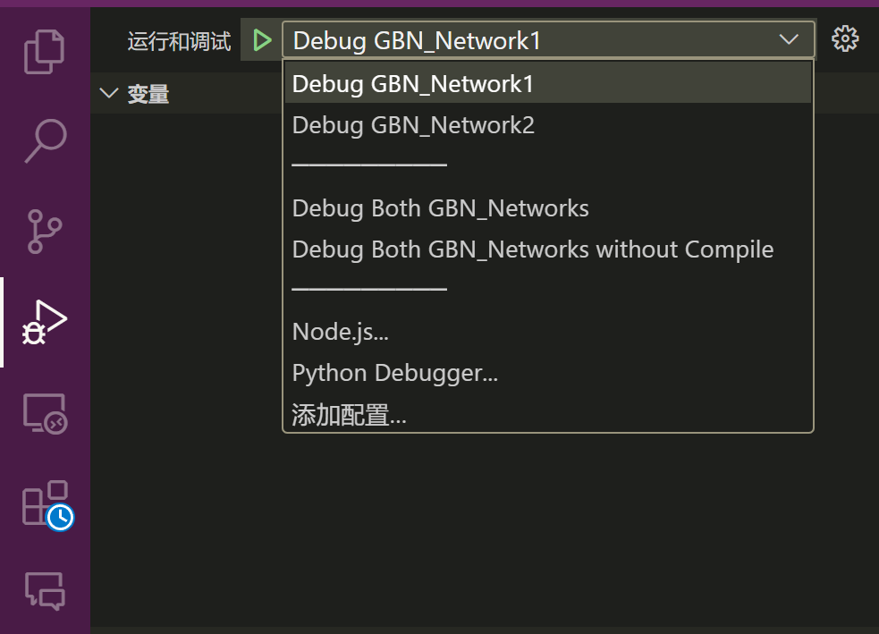

# Reliable file transfer using Go-Back-N protocol

@GDDG08

## Environment

- cmake (version 3.24.1)
- GNU Make (4.2.1)

## System Deployment, Startup, and Use

Detail in [report#Deployment](./report.md#系统部署与使用)

**NOTICE:**

- Use **Debug Launch**, not file debug
  - Run `Debug Both GBN_Networks` to build two terminal and run

    

- To build manually, use Ctrl+Shift+B to run `makeRun` task

## System Design
Detail in [report#Design](./report.md#设计Design)

