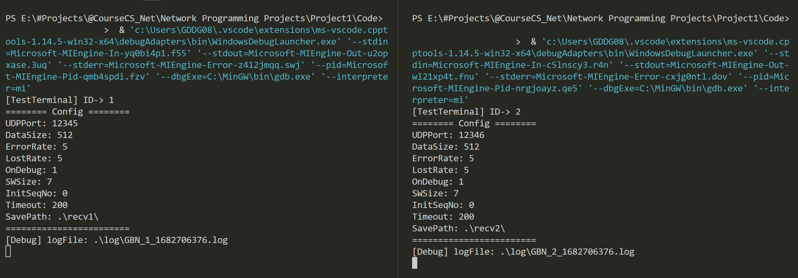
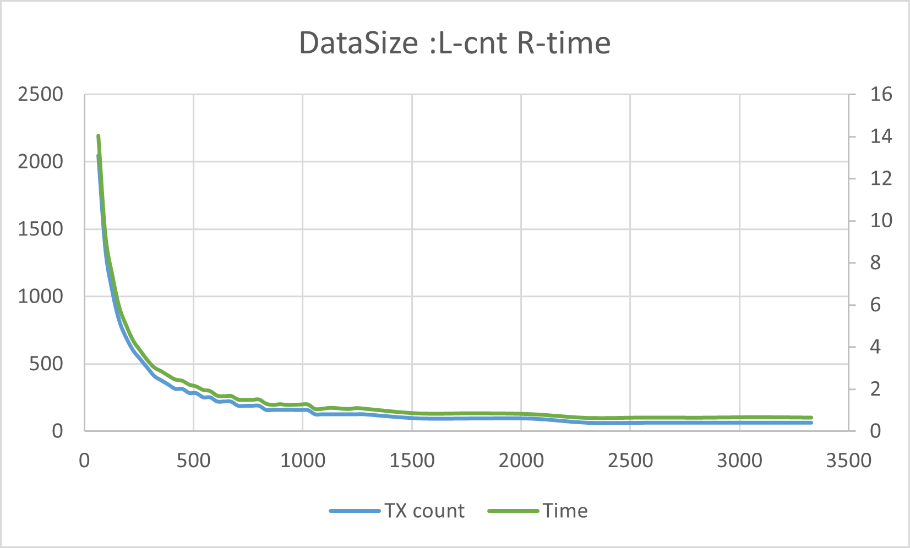

# GBN编程项目报告

@GDDG08

## 需求分析 Requirement Analysis 

### 实验目标

本项目目标是使用GBN（Go-Back-N）协议实现可靠的文件传输。

- 能够在不同主机之间传输大文件，并且保证传输完毕后，接收并保存的文件与发送的原始文件一致。

- 实验中采用UDP Socket API模拟并实现PDU（协议数据单元）的发送和接收，每个UDP数据报封装一个PDU。
- PDU中包含序号、数据、校验码等字段，校验码采用CRC-CCITT标准。
- 支持全双工，实现双向文件传输
- 实现通信模拟，可以配置PDU错误率和丢失率。
- 需要记录通信状态日志，对通信效率进行统计分析。

### Go-Back-N ARQ协议

Go-Back-N 是一种数据链路层协议，是滑动窗口协议的一种，使用滑动窗口方法来实现可靠的顺序传输数据帧。其中发送方可以连续发送多个帧，而不需要等待接收方的确认，只要发送窗口内有空闲位置。接收方则只能接收按序到达的第一个帧，并对其发送累积确认，表示到这个帧为止的所有帧都已正确收到。如果接收方收到了乱序到达的帧，它会丢弃该帧，并重复发送对上一个按序到达的帧的确认。

Go-Back-N ARQ协议的特点是：

- 发送方维持一个固定大小的发送窗口，表示可以连续发送的帧的数量。窗口大小由参数N决定，因此协议也叫做Go-Back-N。
- 接收方维持一个大小为1的接收窗口，表示只能接收按序到达的第一个帧。
- 发送方每收到一个确认，就把发送窗口向前滑动一个帧的位置，并发送新的帧。
- 接收方每收到一个按序到达的帧，就把接收窗口向前滑动一个帧的位置，并发送确认。
- 如果发送方发现已发送的帧中有错误发生，或者超时没有收到确认，那么它会从发生错误或超时的那个帧开始，及其之后所有已发送的帧全部重新发送。这就叫做回退N帧（Go-back-N）。
- 如果接收方发现收到的帧中有错误发生，或者收到了乱序到达的帧，那么它会丢弃该帧，并重复发送对上一个按序到达的帧的确认。


GBN的优点有：

- 高效性：提高信道利用率，因为发送方不用等待每个帧的确认，而是可以连续发送多个帧。
- 简单性：简化接收方的逻辑，因为接收方只需要处理按序到达的第一个帧，并且只需要发送累积确认。
- 可靠性：可以保证数据包的完整性和顺序正确
- 可调节性：相比于Stop and wait，GBN的重传和超时以及窗口大小参数可以跟随网络环境进行优化配置，更加适合实际网络环境。

GBN的缺点有：

- 过多的重传：如果有一个帧出错或丢失，那么从那个帧开始及其之后所有已发送的帧都要重新发送。
- 严格顺序接收：不能充分利用接收方已经正确收到但未按序到达的帧，这些帧会被丢弃，并且需要等待重传。

### 需求难点

- 需要考虑Window下的socket-UDP实现，以及发送和接收的异常处理，如缓冲区满
- 需要考虑应用层、链路层、硬件层的交互通信问题
- 需要考虑效率优化，使用多线程和任务队列等实现层级间、任务间的缓冲机制。
- 需要考虑多线程的优先级和冲突资源抢占问题
- 需要考虑全双工通信和多目标并发问题
- 需要考虑多个文件同时接收时的数据分配问题
- 需要考虑GBN机制稳定性问题，如超时重发的优先级高于新包的发送
- 需要考虑线程高速轮转中的日志打印和控制台输出的效率问题
- 需要实现模拟的错误传输和丢包问题

## 设计 Design

### 工程架构

工程整体的架构设计如下


#### 主要模块定义

| 模块名称      | 功能                                 |
| ------------- | ------------------------------------ |
| physicalLayer | 使用winsock中UDP模拟硬件层           |
| dataLinkLayer | 链路层，实现滑动窗口和GBN机制        |
| networkLayer  | 网络应用层，处理文件发送和接收       |
| testTerminal  | 测试程序入口，可以编译生成多个客户端 |
| BlockingQueue | 阻塞队列，用于线程间通信             |
| Timer         | 定时器                               |
| Frame         | PDU结构                              |
| Packet        | 网络应用层包结构                     |


#### 模块交互

#### 总体流程图

主要模块的交互流程如下，图中重点反映了不同层之间的调用与回调交互逻辑，以及线程间使用的BlockingQueue缓冲机制

### 网络传输相关设计

#### 配置文件

配置文件格式使用json，便于用户修改，具体内容如下

```json
{
    "UDPPort": 12346,	
    "DataSize": 512,
    "ErrorRate": 5,
    "LostRate": 5,
    "OnDebug": true,	//是否开启模拟
    "SWSize": 7,
    "InitSeqNo": 0,
    "Timeout": 200,
    "SavePath": ".\\recv2\\"
}
```

#### PDU(Frame)结构

参考 Computer Networks (A.S.Tanenbaum, 5th Edition)书第 3 章中 Protocol 5 定义的 PDU，定义Frame结构如下


- 其中type定义为：

- ```cpp
  typedef enum {
      DATA = 0,
      ACK = 1,
      NAK = 2,
      END = 3,
  } FRAME_TYPE;
  ```

- flag用于标记Packet切片类型

- checksum使用CRC-CCITT

#### Packet结构

考虑到我的项目计划实现多个文件的发送，我不能单纯的将文件内容发送给链路层，这样无法区分文件类型，因此我在网络应用层设计了包含文件操作的Packet。


其中type和对应的info设计如下：

- PACKET_TYPE::HELLO 网络应用层消息发送

  hello message字符串

- PACKET_TYPE::FILE_RQT 文件发送请求

  

- PACKET_TYPE::FILE_BUF 文件内容

  

- PACKET_TYPE::FILE_FIN 文件发送结束

  

#### Framing设计

链路层的一大功能，就是针对网络层提供的Packet，分割为较小的Frame，其中数据大小由配置文件中DataSize进行配置。

对于网络层提供的Packet，在切割的同时，我使用了单独的线程来负责将Frame放入发送窗口，考虑到空余窗口的释放和多个文件同时发送，我结合使用了BlockingQueue和信号量机制，从而发送窗口被正确填充。

另外，考虑到接收方无法得知分割的Frame中数据如何构成完整的Packet，我在每个切片初始增加了一位FLAG，用于标识同一个Packet的所有切片中的最后一位。

#### GBN中ack、nak和timeout机制设计

这里的核心结构，我参考了 Computer Networks (A.S.Tanenbaum, 5th Edition)书第 3 章中 Protocol 5 ，并做了大量的修改工作。

- 使用了eventQueue这一阻塞队列，平衡来自网络层和硬件层尤其是多个文件发送线程的请求。

- 我将新文件数据包含在eventQueue中，抛弃了之前使用的静态buff方式，方便内存管理
- timer的实现由我自己完成，在链路层初始化时构建长度为发送窗口大小的timer列表，并在发送和ACK时进行start和stop。
- 新增了NAK状态，可以实现Selective ARQ模式
- 使用nqueue和nbuffer结合mutex和conditon_varieble管理网络层发送线程，保证窗口大小，同时保证了发送方的定时器超时事件和ACK接收可以被优先响应。
- ACK修改为下一个要接受的seq_id

#### piggyback机制设计

piggyback的设计核心目的是减少ACK包的发送量，包含两种方式：

- 在发送数据帧时，在包头中包含ack信息

- 在接收多个帧时，直接使用最后接受的帧标号

其核心是定时器的运用：

1. 数据接收成功，开启ACK定时器
   - 一段时间后状态不改变，发送最新的ack值，失能定时器
2. 如果有数据发送，失能定时器
3. 如果当前已经有定时器启用，不启用新的定时器

### 增强功能设计

#### 错误和丢包模拟Debug设计

这里我们在physicalLayer实现，并且Debug由配置文件中ErrRate、LostRate、onDebug三个项目进行控制。

流程如下：

1. 生成随机数
2. 概率LostRate
   - 该包丢弃不发送
3. 否则再次生成随机数
4. 概率ErrRate
   - 随机取数据中某一位，+0x01

这里在模拟错误时，我随机在Frame中任何位置进行了位改变，这里包含了数据以及Frame的header和校验部分，更加符合实际情况。

#### 日志输出

在日志方面我在实验要求基础上，还增加了错误输出、模拟动作以及网络应用层关于文件的操作。

日志格式如下：

```shell
[NetworkLayer] send file to 127.0.0.1:12346 of test6.txt size 128888 Bytes
[NetworkLayer] recv file RQT from 127.0.0.1:12346 of [0]test3.txt(688888 Bytes)
[NetworkLayer] recv file BUF of 0 +45056
[NetworkLayer] recv file [1]test4.txt finished!
...
[DataLinkLayer] TX	1, pdu_to_send=0, status=New, ackedNo=0
[DataLinkLayer] RX	120, pdu_exp=0, pdu_recv=0, status=OK
[DataLinkLayer] TX	ACK 1
[DataLinkLayer] TX	ACK 3 [piggyback]
...
[PhysicalLayer] TX Debug Error generated on byte 93
[PhysicalLayer] TX Debug Lost
...
```


#### 面向多文件并发传输的设计

除了在Packet中设置了文件流控制信息外，由于需要实现多文件并行发送，而不是简单的使用队列依次发送，我们需要在网络层向链路层传递文件信息时，提前**加入分包设计**。也即，定义网络层向链路层传递的一个Packet中最大能包含的文件数据长度，这样，大文件在发送时被切片传送给链路层，多个大文件的Packet轮流使用网络资源，可以实现多个文件的并发发送。

另外，Packet中的文件ID和文件名称信息，在文件接收方被用于构建一个**“正在传输文件”map**，该map保存了当前正在传输的文件发送方地址和文件信息，这样接收方在同时接收多个来自不同发送方的文件时，可以将文件数据写入正确的目标。

#### 面向多主机全双工传输的设计

我还设计了多个主机的全双工传输机制。在接收线程和发送线程独立的基础上，我在网络层-链路层-硬件层的上下级交互中，**保持传递了发送方的地址与端口信息**，这样每一层都可以根据发送方的信息，进行相应的处理，比如链路层可以针对当前帧的信息向发送方发送ACK回馈，网络层可以用改地址查询文件传输列表map，将文件写入唯一对应的目标路径。

另外，考虑到滑动窗口中seq ID机制，面向多个客户端同时通信时，**每个客户端都要有相应独立的窗口体系**，在本设计中，这就要求每个目标地址都要对应一个DataLinkLayer实例，同时每次发送与接收请求被相应的DataLinkLayer处理，这就需要维护一个目标机-链路层的列表，考虑到这样的查表操作会导致程序架构变得混乱，同时考虑到实际的网络结构，面向多主机同时通信的设计与测试暂时搁置，仅实现依次全双工通信。


## 开发与实现 Development and Implementation

### 实验环境

#### 硬件环境

- AMD Ryzen 7 6800H with Radeon Graphics 3.20 GHz
- 8核心16线程，Cache：L1 512KB, L2 4MB, L3 16MB
- RAM: 16G 6400MHz

#### 软件环境

- 系统环境：Windows 10 Pro 22H2 19045.2673
- 开发语言：C++ 14
- 编译环境：
  - cmake version 3.24.1
  - GNU Make 4.2.1
- 调试任务配置环境：VS Code

### 代码架构

整体代码架构如下


### 多终端编译与Debug配置

我使用CmakeList结合testTerminal.cpp中的宏定义，实现了在一次编译任务中，编译出多个测试终端，他们会读取不同的配置文件，简化了代码，也方便了我的调试工作。

Cmake配置文件节选：

```cmake
add_executable(${PROJECT_NAME}${HOST_ID_1} testTerminal.cpp ${DIR_NETWORK} ${DIR_TOOLKIT})
set_target_properties(
    ${PROJECT_NAME}${HOST_ID_1} 
    PROPERTIES
    COMPILE_DEFINITIONS HOST_ID="${HOST_ID_1}"
   )
add_executable(${PROJECT_NAME}${HOST_ID_2} testTerminal.cpp ${DIR_NETWORK} ${DIR_TOOLKIT})
set_target_properties(
    ${PROJECT_NAME}${HOST_ID_2}
    PROPERTIES
    COMPILE_DEFINITIONS HOST_ID="${HOST_ID_2}"
   )
   
```

testTerminal.cpp节选：

```cpp
#ifndef HOST_ID
#define HOST_ID "null"
#endif

int main() {
    printf("[TestTerminal] ID-> " HOST_ID "\n");

    Config config("config_host_" HOST_ID ".json");
    Config::ConfigBean cfg = config.parseConfig();
    cfg.printConfig();

    int PORT_TEST = 0;
    std::string ADDR_TEST = "127.0.0.1";
    if (cfg.udpPort == 12345) {
        PORT_TEST = 12346;
        // ADDR_TEST = "192.168.37.250";
    } else {
        PORT_TEST = 12345;
        // ADDR_TEST = "192.168.37.100";
    }
    ...
```


### 代码实现

在这一部分中，对核心代码进行截取展示，具体内容详见源代码。

#### Frame与校验 Frame.hpp

```cpp
class Frame {
   public:
    class Header {
       public:
        FRAME_TYPE type = FRAME_TYPE::END;
        uint8_t seq = 0;
        uint8_t ack = 0;
        Header(FRAME_TYPE type, uint8_t seq, uint8_t ack)
            : type(type), seq(seq), ack(ack) {}
        Header() {}
    };
    Header header;
    std::string info = "";
    uint16_t checksum = 0;

    Frame(FRAME_TYPE type, uint8_t seq, uint8_t ack, std::string info)
        : header(type, seq, ack), info(info) {
        std::string buff = to_buff_head() + info;
        checksum = CheckCRC::calc(buff);
    }

    // construct Frame from buff
    Frame(std::string buff) {
        header.type = (FRAME_TYPE)buff[0];
        header.seq = buff[1];
        header.ack = buff[2];
        uint16_t len = ((buff[3]& 0xff) << 8) | (buff[4] & 0xff);
        info = buff.substr(5, len);
        checksum = ((buff[5 + len] & 0xff) << 8) | (buff[6 + len] & 0xff);
    }
    ...
    std::string to_buff_all() {
        std::string buff = to_buff_head() + info;
        buff += (checksum >> 8) & 0xff;
        buff += checksum & 0xff;
        return buff;
    }
};
```


#### 任务队列 msgQueue.hpp

主要使用了`std::mutex`和`std::condition_variable`控制队列的更改。

```cpp
template <typename T>
class BlockingQueue {
   private:
    mutable std::mutex mutex_;
    std::condition_variable not_empty_;
    std::condition_variable not_full_;
    std::deque<T> queue_;
    unsigned size_ = 0;

   public:
   ...

    // put but wait if no space
    void put(const T x) {
        std::unique_lock<std::mutex> lock(mutex_);
        while (size_ != 0 && queue_.size() > size_) {
            not_full_.wait(lock);
        }
        queue_.push_back(std::move(x));
        not_empty_.notify_one();
    }
    
    T get() {
        std::unique_lock<std::mutex> lock(mutex_);
        while (queue_.empty()) {
            not_empty_.wait(lock);
        }
        const T front = queue_.front();
        queue_.pop_front();
        not_full_.notify_one();
        return front;
    }
    ...
};
```

#### 定时器 Timer.hpp

定时器采用单独线程，实现了setTimeout()回调操作。

起初我在编写时仅仅使用了isRunning一个控制量，但是由于滑动窗口中为了节省资源，每个窗格对应的timer不会重新初始化，而是重复调用stop和start，这在高速测试中导致了废弃线程的非预期执行，因此加入了threadTime，将当前线程的启动时间与计时器当前启动时间进行比较判定，问题得以解决。 

```cpp
class Timer {
   private:
    std::thread timerThread;
    bool isRunning = false;
    // get current time in ms
    long long startTime;

    int duration;
    std::function<void()> callback;
    void sleepAndRun(long long threadTime) {
        std::this_thread::sleep_for(std::chrono::milliseconds(duration));
        if (isRunning && (threadTime == startTime)) {
            callback();
        }
    }
   public:
	...
    void start() {
        if (isRunning)
            return;
        isRunning = true;
        startTime = getTime();
        timerThread = std::thread(&Timer::sleepAndRun, this, startTime);
        timerThread.detach();
    }
    void stop() {
        isRunning = false;
    }
    ...
};
```

#### GBN实现

这一部分代码全部为dataLinkLayer内容，该文件中包含了滑动窗口协议的实现、硬件层网络层交互等核心内容。

##### eventQueue机制

这一部分我参考了Procotol5中的GBN实现方式，构造一个eventQueue事件队列，链路层的核心线程一直在执行handleEvents()函数，从而不断处理事件内容。

事件类型定义如下

```cpp
typedef enum { FRAME_ARRIVAL,		// 收到正确的Frame
               CKSUM_ERR,			// 收到的Frame未通过校验
               TIMEOUT,				// 发送超时
               NETWORK_LAYER_READY 	// 网络层有新的包添加到窗口
} GBN_EVENT_TYPE;
```

事件结构和事件队列定义为

```cpp
typedef struct {
    GBN_EVENT_TYPE type;
    Frame::Header header;
    std::string packet;
    PhyAddrPort ap;
} GBN_EVENT;

typedef BlockingQueue<GBN_EVENT> GBNEventQueue;
```

注意这里我将传送的Frame也放入到了EVENT中，这样可以简化链路层内共享缓冲变量的维护，取消发送缓冲区buff，提高内存利用率，同时结合BlockingQueue的底层实现，最大程度降低多线程并发的冲突，提高效率。

核心处理函数如下，移除了部分注释和日志代码

```cpp
oid DataLinkLayer::handleEvents() {
    GBN_EVENT event = eventQueue->get(); /* four possibilities: see event type above */
    ...
    switch (event.type) {
        case GBN_EVENT_TYPE::NETWORK_LAYER_READY:/* transmit a new frame. */
            buffer[next_frame_to_send] = event; /* insert event into buffer */
            nbuffered++;                        /* expand the sender’s window */
            nqueued--;
            sendData(ap, packet);    /* transmit the frame */
            inc(next_frame_to_send); /* advance sender’s upper window edge */
            break;
        case GBN_EVENT_TYPE::FRAME_ARRIVAL: /* a data or control frame has arrived */
            ...
            break;
        case GBN_EVENT_TYPE::CKSUM_ERR:
            sendNAK(ap, header.seq);
            break;
        case GBN_EVENT_TYPE::TIMEOUT: /* trouble; retransmit all outstanding frames */
           	...
            break;
    }
}
```

其中FRAME_ARRIVAL和TIMEOUT处理机制将在后文进行讲解。

##### 网络层数据传递

```cpp
std::unique_lock<std::mutex> lock(mtx_Nqueue);
for (size_t i = 0; i < frameNum; i++) {
	...
    if (!isNetworkLayerEnabled) {
        networklayer_ready.wait(lock);
    }
    eventQueue->put({GBN_EVENT_TYPE::NETWORK_LAYER_READY,
                     Frame::Header(),
                     frame,
                     ap});
    nqueued++;
    update_state_network_layer();
}
```

 

##### 超时重发机制

重发的逻辑如下：

1. 在sendData时，当硬件层传输结束，调用`start_timer(next_frame_to_send);`开启该窗口位置的超时定时器
2. 当收到该帧ACK，停止计时器
3. 如果定时器的超时回调，在事件队列中加入TIMEOUT事件
4. event处理函数收到超时事件，刷新当前全部定时器，并重发窗口内所有包，也即Go-Back-N操作。

这里为了避免多个定时器的重复触发，以及解决在定时器触发和事件处理的延迟导致的重复事件问题，引入了信号量和状态量，来保证同一时间只有一个定时器线程触发，同时在第一个触发到超时事件得到处理的间隔内，不会有新的定时器生成超时事件。

定时器触发后执行的代码如下：

```cpp
unique_lock<mutex> lock(mtx_timer);
if (!this->onTimeout) {
    this->onTimeout = true;
    // stop all other timers
    stop_timer_all();
    this->eventQueue->put({
        GBN_EVENT_TYPE::TIMEOUT,
        Frame::Header(), "", PhyAddrPort()
    });
}
```

GBN_EVENT_TYPE::FRAME_ARRIVAL的处理：

```cpp
stop_timer_all();                       /* cancel all timers */
next_frame_to_send = ack_expected;      /* start retransmitting here */
reSendAllData(GBN_EVENT_TYPE::TIMEOUT); /* resend buffered frames */
this->onTimeout = false;
```

##### Packet Framing 帧分割

分割是在网络层传来数据时进行的，分割后放入eventQueue。

这里简单的将FLAG定义为：

- 第一个Frame和中间Frame对应“@”
- 最后一个Frame对应“#”

发送代码：

```cpp
for (size_t i = 0; i < frameNum; i++) {
    std::string frame;
    if (i < frameNum - 1) {
        frame = "@" + packet.substr(i * DATA_SIZE, DATA_SIZE);
    } else {
        frame = "#" + packet.substr(i * DATA_SIZE, lastSize);
    }
    ...
}
```

Packet切片合并是在接收硬件层数据并被窗口接收时进行的。

接收代码：

```cpp
recvBuffMap[ap.getStr()] += packet.substr(1, packet.size() - 1);
if (packet[0] == '#') {
    to_network_layer(ap, recvBuffMap[ap.getStr()]); /* pass packet to network layer */
    recvBuffMap[ap.getStr()].clear();
}
inc(frame_expected); /* advance lower edge of receiver’s window */
sendACK(ap);         /* acknowledge the frame */
```


##### Piggyback ACK机制

当数据被窗口接收，即调用sendACK，此时采用懒惰机制：

- 开启定时器，一段时间内该ACK没有被发送，则单独发送最新ACK
- 在发送数据的同时附带ACK，告知定时器线程
- 当ACK定时器存在时，拒绝其他ACK请求。

也即需要实时维护超时定时器和状态量，其难点前文已分析，这里类似地引入了mutex，以解决高速接收下ACK的准确发送。

代码如下：

```cpp
int DataLinkLayer::sendData(PhyAddrPort ap, std::string packet) {
    std::unique_lock<std::mutex> lock(mtx_ack);
	...send data...
    if (!isACKsent) {
        isACKsent = true;
    }
    ...
    return 0;
}

int DataLinkLayer::sendACK(PhyAddrPort ap) {
    std::unique_lock<std::mutex> lock(mtx_ack);
    if (!isACKsent)
        return 1;		
    isACKsent = false;
    ackTime = new Timer([ap, this]() {
        std::unique_lock<std::mutex> lock(mtx_ack);
        if (this->isACKsent) {
            return;
        }
        Frame s(FRAME_TYPE::ACK, 0, this->frame_expected, "");
        physicalLayer->sendData(s.to_buff_all(), ap);
        isACKsent = true;
    },
                        TIMEOUT / 5);
    ackTime->start();
    return 0;
}
```

在GBN_EVENT_TYPE::FRAME_ARRIVAL的处理中，

- 对于数据帧，会经历DATA和ACK两次处理，从而实现piggyback ACK的接收
- 而对于控制帧如ACK、NAK，则直接进行处理

```cpp
switch (header.type) {
    case FRAME_TYPE::DATA:
        if (header.seq == frame_expected) {
            ...deal with data...
            inc(frame_expected);
            sendACK(ap);         
        }
        // break; //support data with ack piggyback
    case FRAME_TYPE::ACK:                 
        while (between(ack_expected, header.ack, next_frame_to_send)) {
            nbuffered--;              /* one frame fewer buffered */
            stop_timer(ack_expected); /* frame arrived intact; stop timer */
            inc(ack_expected);        /* contract sender’s window */
            ...
        }
        break;
```


 

## 系统部署与使用 System Deployment, Startup, and Use

该系统设计为使用cmake进行编译配置，运行时可以在同主机不同端口，也可以部署于不同主机，允许任意多个实例间通信。

本工程使用VS Code进行开发，任务配置和Debug配置在`tasks.json`和`launch.json`，可以自动进行编译运行操作。

1. 在testTerminal.cpp修改头部定义，根据需要的测试实例数量和目标ip、端口配置TEST_PORT和TEST_ADDR

2. 如果需要增加实例，请修改CMakeLists.txt

3. 在testTerminal.cpp中修改测试任务，调用`nl.sendFile(PhyAddrPort, filePath)`来发送文件。

   注意，该函数为非阻塞执行，发送过程中可以多次调用，同时请确保在文件发送完毕前，main函数不会退出。

4. 运行调试任务`Debug Both GBN_Networks`

5. vscode会按照配置文件，自动在build文件夹下完成编译工作

   

6. 之后调试器会在内置终端同时启动两个GBN-Network实例

   

注意，在提交的文件中已经包含可执行文件，直接运行，输入回车即可向另一实例发送test6.txt，可以测试两个实例间全双工通信。

 

## 系统测试  System Test

在本单元中，我们着重对ARQ机制可靠性和多终端多文件并发进行测试。

除非特别声明，统一使用配置如下

```json
{
    "UDPPort": 12345,
    "DataSize": 512,
    "ErrorRate": 5,
    "LostRate": 5,
    "OnDebug": true,
    "SWSize": 7,
    "InitSeqNo": 0,
    "Timeout": 200,
    "SavePath": ".\\recv1\\"
}
```

### 单向单文件发送测试

- #### 文本文件test2.txt

  大小为3388890 Bytes

  

  从日志头部可以看到：

  - 发送方发送的文件发送请求Packet、文件内容Packet被网络应用层正确接收解码。
  - 发送方的丢包和错误模拟正常工作
  - 接收方的ACK 懒惰发送正常进行
  - 发送方的超时重发正常运行
  - 发送方的窗口移动逻辑正常，没有窗口越界

  

  从日志尾部可以看到：

  - 连续4个Frame (4,5,6,7)被正确发送和接收
  - 这4个帧构成了文件的最后一部分和文件发送终止Packet，说明Framing机制正常工作
  - 文件传送完成通知被正确解读，说明文件传输列表被正确维护

  

  文件校验通过。

- #### 二进制文件GBN_Network1.exe

  大小为8063902 Bytes

  

​		

​		文件传输成功。

### 单向多文件发送测试

同时发送test3.txt和test4.txt

发送方：


接收方：


文件校验一致。

可以发现test3.txt和test4.txt在被同时传送，前者在3885次传送后完成传输，后者在4514次，说明文件正常并发发送，网络资源均衡分配。

### 双向多文件发送测试

1向2发送test3.txt和test6.txt，同时2向1发送test3.txt

开始阶段：


传输成功：


文件校验一致。

值得注意的是，在该场景中，由于全双工双向收发，piggyback ACK发挥作用：


### 高错误率、丢包率测试

单向发送test6.txt，但是ErrorRate和LostRate设置为50。

test6文件大小为128888 Bytes，理论上如果不发生丢包和错误，252+2次发送即可传输完成。


但在高错误率的情况下，总共2493次发送才完成文件传送，效率10.2%，小于理论成功率25%，可见在GBN的ARQ机制下，高错误率导致的不必要重传也造成了网络资源的浪费。


文件校验一致。

 

## 性能与分析 Performance and Analysis

测试文件为test6.txt(128,888B) ，发送方式为单向单文件发送。

基于以下配置文件，进行单变量影响分析。

```shell
{
    "UDPPort": 12345,
    "DataSize": 512,
    "ErrorRate": 5,
    "LostRate": 5,
    "OnDebug": true,
    "SWSize": 7,
    "InitSeqNo": 0,
    "Timeout": 200,
    "SavePath": ".\\recv1\\"
}
```

测试依托test.py自动进行，考核项目为发送总次数、发送用时。

### 探究单PDU数据长度的影响

理论上，PDU大小会影响同等地影响传输次数和传输时间。

- PDU越短，Packet切片数量越多，发送次数越多；
- PDU越长，整体出错的概率越高，重传的开销也越大。

DataSize在[64, 4096]间取值得到的实验数据如下


可以看到，传输次数和实践变化趋势基本相同，在测试范围内与DataSize成负相关，且近乎反比关系。

考虑到模拟Error和Lost与Frame大小互相不构成影响，缺给实验引入了随机因素，导致实验数据抖动，因此关闭错误模拟，再次进行测试。



得到的新的实验数据非常平滑，反应在该测试模型下，DataSize越大，传输时间越短，次数越少，传输效率越高。

值得注意的是，理论上DataSize不是越大越好，但是由于本次实验环境中，模拟硬件层传输能力较强，传输时间远远小于timeout时间，因此大数据包的重发耗时并没有显著增长，同时还减少了GBN的次数，在测试范围内表现为DataSize和效率成正相关。

### 探究发送窗口大小的影响

理论上，发送窗口是Go-Back-N中的关键影响因素，这是由于

- 窗口大小越大，在一定范围内，越能消除传输时延的影响，包发送间无需等待，提高带宽利用率；但同时，遇到错误时重发的数量也越多
- 窗口大小约小，系统越接近Stop and wait模型，对传输时延利用越差，导致发送间等待，带宽利用效率低；但同时，遇到错误只需要重发小数量Frame

SWSize在[1, 127]间取值得到的实验数据如下


可以看到，考虑错误率随机因素的影响，整体上传输数量与SWS成正相关，传输时间随SWS增长而快速下降后收敛波动。分析认为：

- 传输数量的增长是由于超时重发时发送数量刚好为SWS，当SWS变大，传输中每次重发发送数量变多，同时重发中出现错误多次重发的概率也增大。
- 传输时间在其实阶段的下降，是由于SWS<1+2alpha，传输通道利用率随SWS增加而增加，而当SWS>10，传输通道利用率已达到1，带宽已被完全利用。

因此根据图像，可以认为SWS取值7较为合适。

### 探究Timeout时间的影响

理论上，超时时间仅仅会影响传输时间，不会影响传输次数。

Timeout在[100, 2000]间取值得到的实验数据如下


可以看到，考虑随机错误模拟因素，传输次数基本没有变化，而传输时间与超时时间成正相关。

观察曲线形状，可以认为得到的实验数据中传输时间收到超时时间和该次传输中随机模拟错误次数的叠加影响，导致其在随超时时间增长的同时，受传输量变化而波动。

### 探究错误率丢包率的影响

理论上，错误率丢包率越高，重传次数越多，所用时间越长。

由于本次实验使用的是GBN模式，而不是Selective ARQ，校验错误的NAK不被处理，因此此时模拟的错误事件和丢包事件被同等处理，都是依靠计时器超时重发机制。因此在这里我们合二为一，探究传输出错这一整体因素的影响。

设置错误率为0，丢包率取[0,30]，数据如下


可以直观的看到，丢包率越高，传输时间越长，传输次数越多。丢包率与两个测试量成线性相关。

 		

## 项目总结 Summary or Conclusions

在本次项目中，我基于C++ 14实现了一个Go-Back-N链路层滑动窗口协议，并在此基础上实现了可靠大文件传输，系统大量设计了多线程、互斥锁、消息机制、缓冲队列等机制，具有全双工通信、多终端通信、文件并发传输等功能特点，系统效率较高。

同时我还配置了cmake多测试终端自动编译，便于项目部署测试。另，受限于时间和工程量，我设计的多主机间并发通信机制（多DataLinkLayer实例）的实现还有进一步完善的空间。

经过系统测试，该GBN文件传输系统很好地模拟实际链路层运作情况，超时重传和piggyback多线程间的缓冲合作与互斥竞争机制完善无误，系统文件传输效率高，文件传输校验一致，可以适应文本文件、二进制文件等多种文件的可靠传输，还可以实现多文件并发、客户端间全双工通信等增强功能。后我还对GBN机制中的参数进行了探究实践，编写了python自动化测试脚本测试了传输时间和传输次数与PDU大小、SWS、错误率、超时时间的关系，并做出了详细的数据分析，对于GBN机制和协议架构有了更为深刻的理解。

综合看来，本次项目实现的GBN完全符合系统需求，同时其高效性、可靠性得到了验证，模拟系统反应的性质与GBN理论推算表现一致，项目完成出色。

## 参考资料 References

1. Tanenbaum, A. S., & Wetherall, D. J. (2010). *Computer networks* (5th ed.). Prentice Hall.
2. C++ 多线程编程（一）：std::thread的使用 https://blog.csdn.net/zhouqt/article/details/127526840
3. 使用 Winsock - Microsoft https://learn.microsoft.com/zh-cn/windows/win32/winsock/using-winsock
4. condition_variable 条件变量 https://blog.csdn.net/qq_39277419/article/details/99544724
5. Peterson, L. L., & Davie, B. S. (2019). *Computer networks: A systems approach* (6th ed.). Morgan Kaufmann.
6. Kurose, J. F., & Ross, K. W. (2016). *Computer networking: A top-down approach* (7th ed.). Pearson Education.

 

## 实验心得  Comments

本次实验我收获很大，难度也较大，笔者选择了实现网络编程效率较高的C++为实现语言，这样可以更贴近操作系统socket和线程等原生操作，但也带来了较大的上手难度，其中多线程间的互斥和共享问题最为复杂，这关系到Piggyback ACK、超时事件优先响应等核心机制，同时我设计的不同层级之间的交互和缓冲机制也有一定的实现难度。

我认识到，实际的实现与GBN Protocol5相差甚远，原型一些设计无法适应项目需求，如高速发送和并发发送，Timer和窗口的高速更新带来了许多新的问题，如piggy ACK的丢失和重复发送、多网络层请求的平衡等高并发多线程场景，我在设计和实验中一一细化解决，这让我对于滑动窗口协议有了非常细致的理解。最后的参数实验更让我理论联合实际，深刻体会到了GBN协议的工作原理。

这次实验不仅大大提高了我的CPP编程能力，还培养了我的自主学习能力。